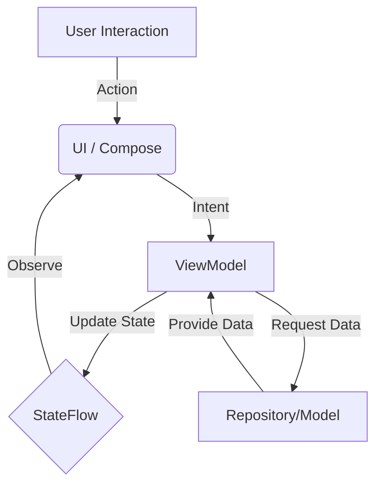

# 🎨 Colorful CardView Sample

  
  
  
  

---

## 🚀 Overview
Welcome to **Colorful CardView Sample**, a personal education project meticulously crafted to master **Modern Android Development (MAD)**. This project isn't just a list of cards; it's an exploration of UI/UX delight, state management, and architectural excellence in Kotlin.

> "🔮 A playground where colors meet clean code."

---

## ✨ Features

### ✨ Visual Experience
- **Entertaining UI**: A dynamic, grid-based interface with high-fashion typography.
- **Micro-interactions**: "Squishy" scale animations and glassmorphic card effects for tactile feedback.
- **Dynamic Theming**: Screens that adapt their background and style based on the selected item's palette.

### 🛠️ Technical Prowess
- **MVVM Architecture**: Clean separation of concerns between Data, Logic, and UI.
- **Jetpack Compose**: 100% declarative UI with nested scroll behaviors and advanced layouts.
- **StateFlow & CollectAsState**: Reactive data streams for seamless UI updates.
- **Navigation Compose**: Smooth transitions between the discovery grid and detail views.

---

## 📸 Gallery & Visuals

  
  
  

  
  
  

  
  
  

---

## 🏗️ Architecture (MVVM)
The project follows the official Android architecture guidelines to ensure scalability and testability.

### 🗺️ System Flow Chart

### 📂 Structural Breakdown
- **`model/`**: Pure Kotlin data classes representing the "Vibe" items.
- **`viewmodel/`**: Logic layer managing the `MutableStateFlow` of items and navigation logic.
- **`ui/components/`**: Modular, reusable Compose functions (Atomic Design principles).
- **`ui/theme/`**: Centralized color, typography, and shape definitions.

---

## 📊 MAD Score (Modern Android Development)
This project aims for a high MAD Score by utilizing the latest Jetpack libraries.

| Category | Technology | Score |
| :--- | :--- | :--- |
| **Language** | Kotlin (Coroutines, Flow) | ⭐⭐⭐⭐⭐ |
| **UI** | Jetpack Compose | ⭐⭐⭐⭐⭐ |
| **Architecture** | ViewModel, StateFlow | ⭐⭐⭐⭐⭐ |
| **Tooling** | Android Studio Panda, Gradle KTS | ⭐⭐⭐⭐ |

---

## 🛠️ Tech Stack
- **Language**: [Kotlin](https://kotlinlang.org/)
- **UI Framework**: [Jetpack Compose](https://developer.android.com/jetpack/compose)
- **State Management**: [StateFlow & Flow](https://kotlinlang.org/docs/flow.html)
- **Dependency Management**: [Gradle Kotlin DSL](https://docs.gradle.org/current/userguide/kotlin_dsl.html)
- **Icons**: [Material Design Icons Extended](https://developer.android.com/jetpack/compose/components/icon)

---

## 📝 How to Run
1. Clone the repository.
2. Open with **Android Studio Panda** (or newer).
3. Run the `:app` module on an emulator or physical device.

---

## 🎓 Learning Objectives
- [x] Mastering `LazyVerticalGrid` and `Scaffold` layouts.
- [x] Implementing custom `InteractionSource` for animations.
- [x] Formatting and handling Color logic (`toArgb` manipulation).
- [x] Deep dive into `TopAppBar` scroll behaviors.

---
